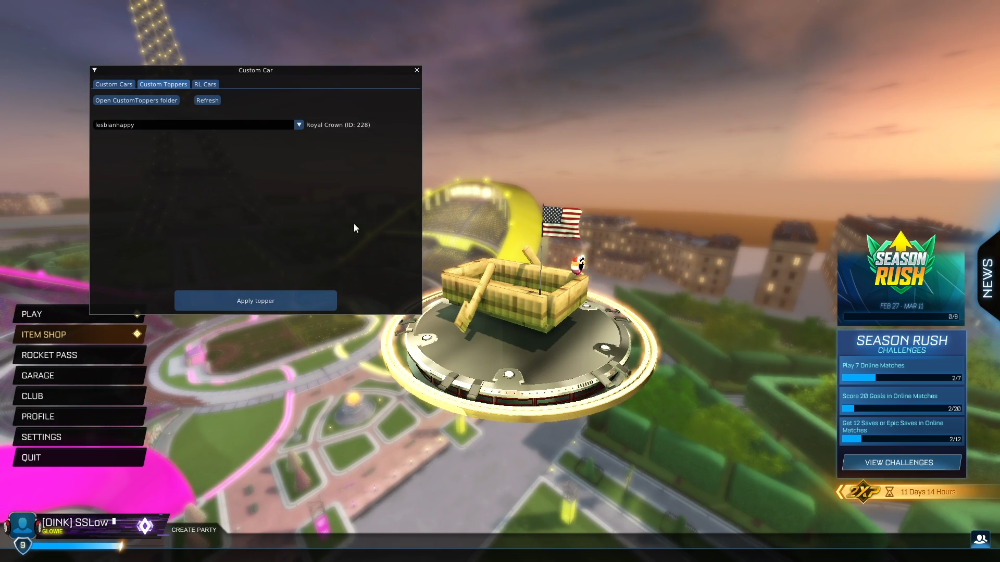

# Custom Car (BakkesMod plugin)
Enables custom cars in Rocket League, for free!

Video showcase: https://www.youtube.com/watch?v=Ipqlp0zsMZc



## ✨ Features
- Use custom 3D models for **car bodies** and **toppers**
- Spawn and use any car in the game
    - **In freeplay:** Hitboxes will be accurate
      - Perfect for test-driving cars before purchasing in RL item shop 👍
    - ~**In online games:** All spawned cars will have Octane hitbox~
      - ~This is due to the game's online protections: If you don't *own* your car, you're forced to use a stock Octane (server-side)~

> [!NOTE]
> BakkesMod is no longer enabled in online games due to the addition of EAC on **April 28, 2026**

## Install the plugin
Follow the install steps in the [latest release](https://github.com/smallest-cock/CustomCar/releases/latest)

## How to INSTALL custom cars
1. Download (or [create](https://youtu.be/OlwnVdYyhbk)) a custom car. You can find some [here](https://alphaconsole.io/browse?category=model)
2. Extract the `.zip` file. Somewhere inside will be a `.json` file and a `.upk` file
3. Click the `Open CustomCars folder` button in the plugin, and put the `.json` file in that folder
4. Open the `CookedPCConsole` folder of your RL installation, and put the `.upk` file there
    - An example `MyCustomCar.upk` installed on Epic (the path will be different for Steam users):
      ```
      C:\Program Files\Epic Games\rocketleague\TAGame\CookedPCConsole\mods\CustomCars\MyCustomCar.upk
      ```
    - You can create subfolders to organize your `.upk` files if you want. As long as the `.upk` files are somewhere inside the `CookedPCConsole` folder

## How to MAKE custom cars
Here's a video tutorial: https://youtu.be/OlwnVdYyhbk
  - Make sure to put the `.json` files in `bakkesmod\data\CustomCar\CustomCars` instead of the `acplugin` folder shown in the video

## Building
Build with CMake using a compatible toolchain for your platform:
- **Windows:** MSVC (via Visual Studio or the Build Tools)
- **Linux:** clang-cl + lld-link
    - Cross-compiles against a local MSVC/Windows SDK install (obtained via [msvc-wine](https://github.com/mstorsjo/msvc-wine))

> [!NOTE]
> Before building with CMake on Windows, the MSVC environment **must** be initialized.
> This is normally handled automatically by IDEs or certain editor extensions like [CMake Tools](https://marketplace.visualstudio.com/items?itemName=ms-vscode.cmake-tools), but if you're building from the command line, do one of the following:
>
> - Use an appropriate Windows terminal profile:
>    - `Developer PowerShell for VS 2022`
>    - `Developer Command Prompt for VS 2022`
> - Or run this script once per shell session:
>   ```
>   C:\Program Files\Microsoft Visual Studio\2022\Community\VC\Auxiliary\Build\vcvars64.bat
>   ```

### 1. Initialize submodules
| Windows | Linux |
|----------|---------|
| `./scripts/init-submodules.bat` | `./scripts/init-submodules.sh` |

<details> <summary>Why a script instead of <code>git submodule update --init --recursive</code> ?</summary>
   <ul>
       <li>Avoids downloading 200MB of history for the <strong>nlohmann/json</strong> library</li>
       <li>Ensures Git can detect updates for the other submodules</li>
       <li>On Linux, applies additional submodule fixes to account for a <strong>case-sensitive filesystem</strong> and <strong>MSVC vs Clang</strong> compilation compatibility</li>
   </ul>
</details>

### 2. Build with CMake
Make sure to have [CMake](https://cmake.org/download) and [Ninja](https://github.com/ninja-build/ninja) installed
- For custom builds (e.g. a different generator than Ninja), create a `CMakeUserPresets.json` and specify it there. [more info](https://cmake.org/cmake/help/latest/manual/cmake-presets.7.html)

| Step | Windows | Linux |
|-------------------|-----------------|---------------|
| 1. Configure | `cmake --preset ninja-release` | `cmake --preset linux-clang-cl` |
| 2. Build | `cmake --build --preset Ninja-Release` | `cmake --build --preset Ninja-Release-Clang` |

- Other presets available in `CMakePresets.json`
- Output binaries will be in `./plugins`
